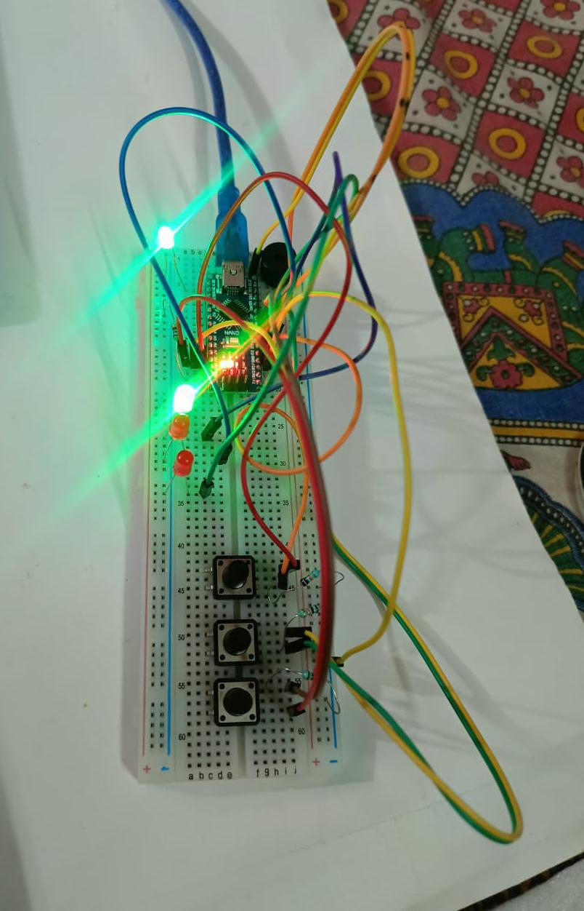

# Manual Pulse-Code Programmer (MPCP) v2.1 🚀

### 📱 Project Hardware & MVP

**[📄 View Detailed Breadboard Setup & MVP (PDF)](MPCP_project_breadboard_setup.pdf)** 
### Overview
The **Manual Pulse-Code Programmer** is an educational ECE project designed to demonstrate how microcontrollers handle binary data and memory at a fundamental level. Instead of writing code on a computer to define a blink pattern, the user "toggles in" the bits manually using electrical pulses. 

### 📜 Historical Context: Programming in the 1940s
In the 1940s, computers like the **ENIAC** or later the **Altair 8800** (1970s) did not have keyboards or monitors. Programmers had to:
* **Physically Flip Switches:** Each switch represented a single bit (0 or 1).
* **Load Memory Manually:** Commands were entered one by one into the machine's registers.
* **No Compilers:** Humans acted as the compilers, converting logic into binary by hand.

This project, the **MPCP**, brings that "Hardwired" experience to the modern Arduino platform.

### 🧠 Direct EEPROM Programming (ATmega328P)
While standard Arduino sketches are stored in **Flash Memory**, this project writes data directly to the **EEPROM** (Electrically Erasable Programmable Read-Only Memory). 
* **The Process:** When you press the 'Confirm' button, the Arduino executes the `EEPROM.write()` command. 
* **The Physics:** This physically changes the state of tiny transistors inside the ATmega328P chip via Fowler-Nordheim tunneling. 
* **Persistence:** Because EEPROM is non-volatile, the 0s and 1s you input remain stored even after the power is disconnected.

### 🛠 Why Hardware-Level Manual Coding is Crucial
Inputting 0 and 1 codes manually is the most fundamental way to interact with a machine. It is crucial because:
1. **Understanding Registers:** It teaches how data is stored in specific memory addresses.
2. **Logic Stability:** It demonstrates the importance of "High" and "Low" voltage states (5V vs 0V).
3. **Bypassing Abstraction:** It removes the "Black Box" of modern software, showing that at the end of the day, all computers only understand electrical pulses.

### 📊 Circuit Diagram

### Project video on Linkedin: https://www.linkedin.com/posts/srijan-das-ece_ece-embeddedsystems-arduino-activity-7427000228769128449-MB56?utm_source=social_share_send&utm_medium=member_desktop_web&rcm=ACoAAGCIe28BBUst2bf5pDQ2LzoRLawjfD1_vE4

### 📦 Components Needed: 
* **1x Arduino Nano** (ATmega328P Microcontroller)
* **3x Push Buttons** (Select, Confirm, Erase)
* **3x 10kΩ Resistors** (Pull-down resistors for buttons)
* **4x 220Ω Resistors** (Current limiters for LEDs)
* **3x Status LEDs** (Bit, Mode, and Erase indicators)
* **1x Playback LED** (Connected to Pin 13)
* **1x Piezo Buzzer** (Audio feedback)
* **Breadboard & Jumper Wires**

### 🔌 Pin Mapping
| Component | Pin | Description |
| :--- | :--- | :--- |
| **Select Button (SW1)** | D2 | Toggles bit between 0 and 1 |
| **Confirm Button (SW2)**| D3 | Saves current bit to EEPROM |
| **Erase Button (SW3)** | D5 | Wipes all saved bits from memory |
| **Buzzer** | D8 | Audio feedback for every action |
| **Playback LED** | D13 | Displays the final 8-bit pulse code |

### 👨‍🔬 Author
**Srijan Das**
* 1st Sem ECE Student at MAKAUT.
* *"Born 🌟 to Create and build 🔥"*.
